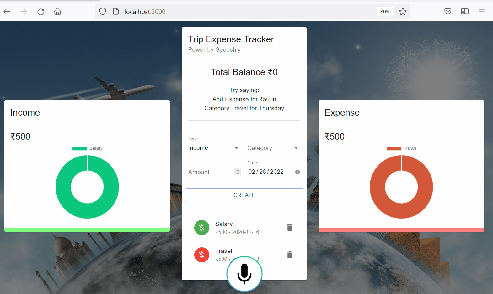

# Trip Expense Tracker App
This project is to maintain the trip expense tracking purpose app. It was made in react framework power by speechly. </br>


## Screen shot 

Main Screen
</br>



### npm commands 
#### build the application 
```
npm run build 
```

#### start the application 
```
npm start
```

Runs the app in the development mode.\
Open [http://localhost:3000](http://localhost:3000) to view it in your browser.

### Docker commands

build :-
```    
    docker build . -t nitinrai17/tripexpensetracker:0.0.1
```

run :- 
```
    docker run -p 80:80 -p 443:443 nitinrai17/tripexpensetracker:0.0.1
```


### Openssl Certificate
```
openssl.exe req -new -newkey rsa:4096 -x509 -sha256 -days 365 -nodes -out nginx-certificate.crt -keyout nginx.key
```


